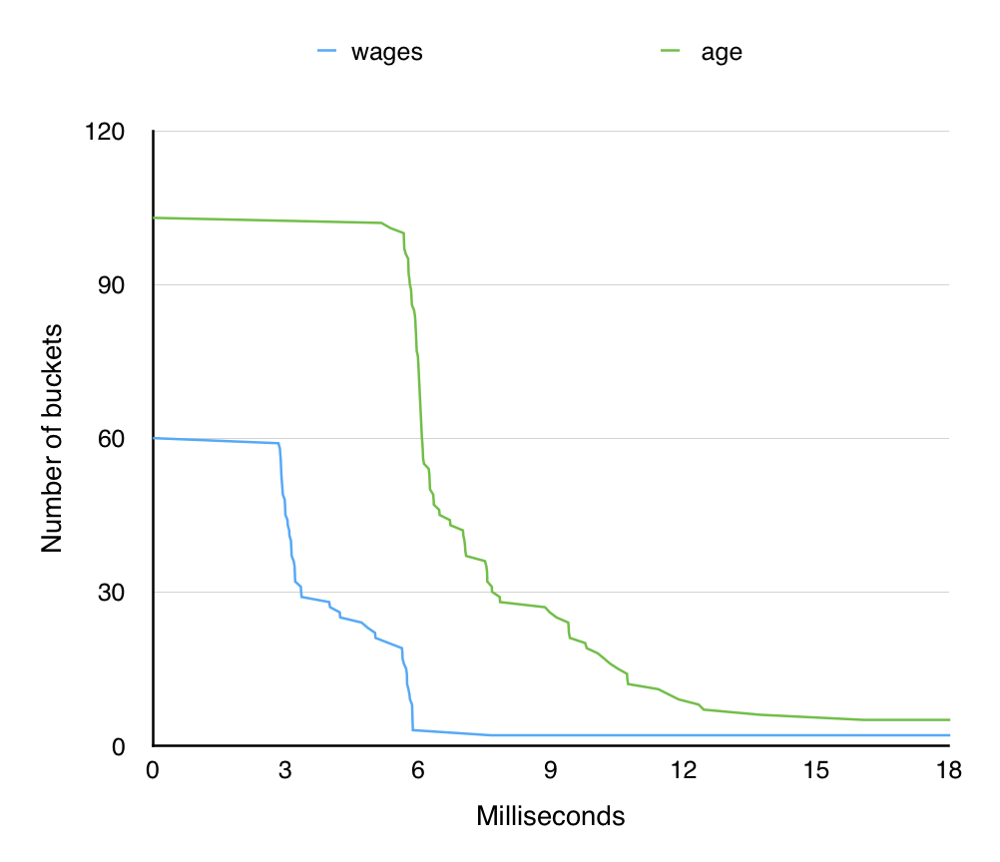
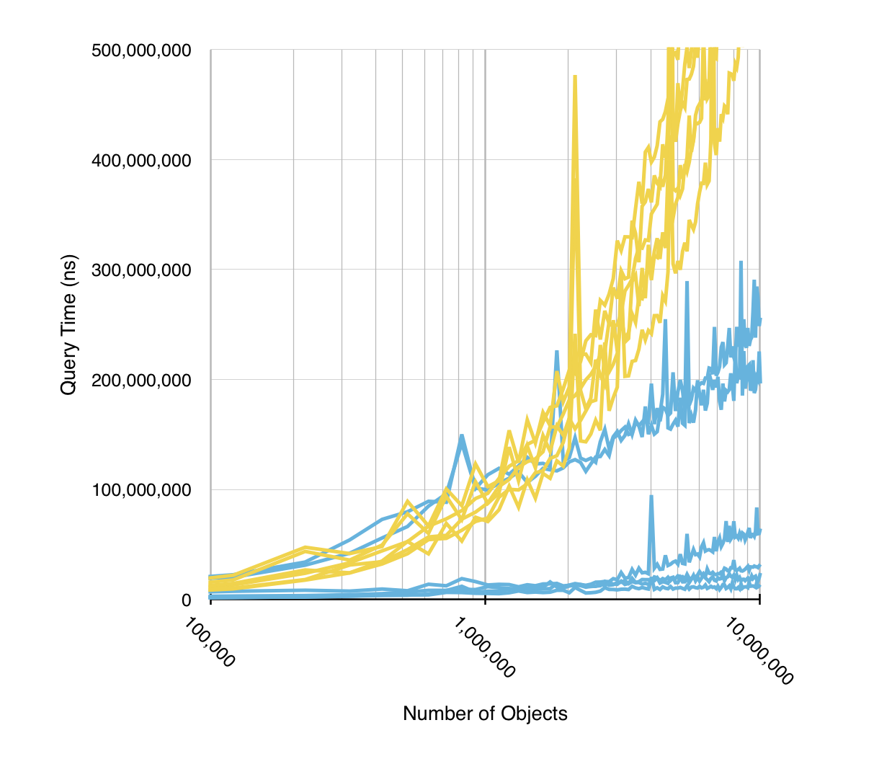

# scoredb

A simple database index optimized for returning results by custom scoring functions.

To my knowledge, it is the only open source system with an algorithm designed for this purpose; in some cases, it is faster than elasticsearch's implementation by an order of magnitude. (see below)

# Why?

Scoredb is optimized for systems that want to find the top scoring results, where the scoring function is specified by the client, 
and may depend on more than one field.
It may be a good choice for any system that needs to incorporate multiple factors when returning results.
For instance, it might power a used car website to produce results based on factors like mileage, year, and distance.


# Run It

Though Scoredb has a straightforward programatic interface, you can run a simple standalone HTTP server like so:

```
$ go get github.com/pschanely/scoredb
$ go install github.com/pschanely/scoredb/...
$ ${GOPATH}/bin/scoredb serve -datadir my_data_directory -port 11625
```
... and in another shell:
```
# insert some people with ages and weights
$ curl -XPUT http://localhost:11625/jim -d '{"age":21, "weight":170}'
$ curl -XPUT http://localhost:11625/bob -d '{"age":34, "weight":150}'

# get people by age
$ curl -G 'http://localhost:11625' --data-urlencode 'score=["field", "age"]'
{"Ids":["bob","jim"]}

# get people by the sum of their age and weight:
$ curl -G 'http://localhost:11625' --data-urlencode 'score=["sum", ["field", "age"], ["field", "weight"]]'
{"Ids":["jim","bob"]}
```


# The Algorithm

Scoredb uses a format on disk that is very similar to that used by text search systems like solr and elasticsearch.
We divide each field into ranges of values (buckets) and, for each bucket, maintain a file containing the IDs of objects that have their value inside that range.

The IDs in each file are strictly increasing; this means that we can traverse several buckets efficiently by using a heap of buckets to find the next smallest id among many buckets.

As we traverse the buckets, we score the objects produced and put them into a candidate result set.  The result set is capped at the `&limit=` parameter specified by the user.  As poorly scoring results get kicked out of the candidate result set, we can infer a lower bound on the final score.  With some math, we can propagate that lower bound backwards through the scoring function to infer bounds on the individual fields.  These bounds may then be used to stop traversing very poorly scoring buckets that could not produce a good enough final score.  In this manner, as the candidate result set gets better and better, the system can eliminate more and more buckets to arrive at a result very quickly.

The following graph shows bucket elimination over the course of an example query combining two fields, "age" and "wages":




# Performance

Few database systems support custom scoring functions, and fewer (possibly none?) use algorithms designed for that purpose.
In practice, I've found elasticsearch's
[custom scoring functions](https://www.elastic.co/guide/en/elasticsearch/reference/0.90/query-dsl-function-score-query.html#query-dsl-function-score-query)
 to be quite fast, so I've benchmarked against it here.  Please let me know about other systems I might benchmark against!

This is a graph of how 5 different queries perform with varying database sizes (yellow is elasticsearch and blue is scoredb):



The elasticsearch query times (yellow) look like they're rising exponentially, but it's actually linear because the X-axis has a logarithmic scale.

The dataset is anonymized US census data, each object representing an individual.  These are the 5 scoring functions used for benchmarking, in order from fastest to slowest (for scoredb):

```
10 * number_of_children + age
10000 * age + yearly_wages
100 * age + yearly_wages
40 * gender + weekly_work_hours
100.0 * gender + 9 * num_children + age + weekly_work_hours
5 * num_children + age + weekly_work_hours
```

This is an unscientific test!  Just my personal laptop, [this datafile](http://millstonecw.com/censusdata.csv.bz2) repeated a few times over for the biggest datasets, and `scoredb benchmark -maxrecords 10000000 -csv censusdata.csv`.  There's no substitute for testing with your own data, queries, and hardware.

It's clear from the graph that scoredb's performance can vary significantly based on the scoring function.
Some guidance on scoring:

* Prefer to combine fields with addition, multiplication, and, in particular, minimum, because they allow the computation of useful lower bounds.  Combining fields with a max() function does not, because a bad value in one field can be completely overcome by a good value in another.
* Combining many fields instead of a few will make the query take longer, because it takes longer to determine useful lower bounds on each field.
* Prefer to engineer weights so that the contributions from each of your fields is similar in scale.  Scoredb may never be able to find useful bounds on fields that tweak the final score very slightly.


# Limitations

Scoredb is minimalistic and highly specialized; it is intended to just act as one piece of a larger system:
* Scoredb **has no delete or update operation**.  To remove or change an object, you must build a new index.  See below for how to swap a new index in under a running instance without downtime.
* It stores objects as a flat set of key-value pairs with string keys and numeric values only. (internally, all values are 32 bit floating point values)
* Scoredb can only respond to queries with lists of identifiers; scoredb's indexes do not provide efficient access to the original field data.
* Scoredb has no built-in clustering, redundancy, or backup functions.
* Adding objects to scoredb is slow if you add them one at a time.  Bulk insertion should be used whenever possible.
* Scoredb requires many open files; sometimes thousands of them.  You will need to increase default filehandle limits on your system (see "ulimit" on linux).
* Scoredb expects you to provide every field for every object; objects that are missing a field cannot be returned from queries that use the missing fields.
* Scoredb data files are endian specific; most modern CPUs are little endian, so you won't normally have to worry about this.

# Index Bulk Load

You can create a database without running a server using the `scoredb load` command, which expects newline separated json records on stdin.
So, for instance:
```
printf '{"id":"person_1", "values":{"age":10, "height":53}}\n' > data.jsonl
printf '{"id":"person_2", "values":{"age":32, "height":68}}\n' >> data.jsonl
cat data.jsonl | scoredb load
```

# Index Swapping

If you need deletes or updates, you'll have to perodically rebuild your database and swap in updated versions.
If you specify the -automigrate option to the server, it will look for new database directories that begin with the given data directory
and keep the (lexigraphically largest) one live.  Use an atomic mv command to put it in place like so:

```
$ cat new_data.jsonlines | scoredb load -datadir ./live_db_v00001  # Load initial data
$ scoredb serve -readonly -automigrate -datadir ./live_db_v        # Start server

# when ready for a new version of the database,

$ cat new_data.jsonlines | scoredb load -datadir ./tmp_db          # Create the database
$ mv ./tmp_db ./live_db_v00002                                     # Rename to match the watched prefix

# The server should detect and load the new database here.

$ rm -rf ./live_db_v00001                                          # Now, remove the old database
```

# Supported Query Functions

As shown above, queries are expressed as JSON expressions and then url encoded into the "score" query parameter.
Each expression takes a lisp-like form: `[<function name>, <argument 1>, <argument 2>, ...]`.  These are the supported functions:

#### `["field", <field_name>]`
Simply produces the value of `<field_name>` as a score.
  * Example: `["field", "age"]` (return the age value as a score)

#### `["scale", <factor>, <subexpression>]`
Takes the result of `<subexpression>` and multiplies it by `<factor>`.  `<factor>` may be negative.
  * Example: `["scale", 2.0, ["field", "age"]]` (age, doubled)

#### `["sum", <subexpression 1>, <subexpression 2>, ...]`
Sums the results of each `<subexpression>`.
  * Example: `["sum", ["field", "age"], ["field", "height"]]` (add age and height together)

#### `["product", <subexpression 1>, <subexpression 2>, ...]`
Multiplies the result of each `<subexpression>` together.  For bounding reasons, negative inputs are not allowed.
  * Example: `["product", ["field", "age"], ["field", "height"]]` (multiply age by height)

#### `["min", <subexpression 1>, <subexpression 2>, ...]`
Takes the least score resulting from all `<subexpression>`s.
  * Example: `["min", ["field", "age"], ["field", "height"]]` (Take age or height, whichever is smaller)

####`["diff", <subexpression 1>, <subexpression 2>]`
Returns the absolute difference between the values produced by both subexpressions.
  * Example: `["diff", ["field", "age"], ["field", "height"]]` (the difference between each age and height)

#### `["pow", <subexpression>, <exponent>]`
Raises the result from the given subexpression to the `<exponent>` power.  
`<exponent>` may be fractional (for Nth roots) or negative.  
However, for bounding reasons, the subexpression may not produce negative values.
  * Example: `["pow", ["field", "age"], 2.0]` (age, squared)

#### `["custom_linear", [[<x1>, <y1>], [<x2>, <y2>], ..], <subexpression>]` 
Establishes a user-defined function using a set of linearly interpolated [x, y] points. 
Inputs smaller than the smallest X value or larger than the largest X value get the closest specified Y value.
  * Example: `["custom_linear", [[0, 0.0], [30, 1.0], [80, 0.0]], ["field", "age"]]` Maping ages to scores: 30 year-olds get a score of one, gradually declining to a score of zero for infants and the elderly.

#### `["geo_distance", <lat>, <lng>, <lat field name>, <lng field name>]` 
Returns the distance to a fixed point in kilometers as a score.  
This is experimental: may be inaccurate for large distances, and fails across the prime meridian.  
Since you typically want smaller distances to have higher scores, you'll probably want to wrap the "scale" or "custom_linear" functions around this one to invert it.
  * Example: `["geo_distance", 40.7, -74.0, "home_lat", "home_lng"]` Scores each result by how far its home_lat and home_lng fields put it from New York City.


# Status

Though it has reasonable test coverage and a small, straightforward codebase, scoredb is certainly alpha-quality software.

Your bug reports are greatly appreciated.


# Thanks

Thanks are due to the [Samsung Accelerator](http://samsungaccelerator.com) which let us start this project as a hackathon proof of concept.  Scoredb was built with this awesome team (in github lexicographic order!):

* https://github.com/davidgljay
* https://github.com/ploxiln
* https://github.com/pschanely
* https://github.com/rmarianski
* https://github.com/sleepylemur


# Plugs

Check out of some of our other side projects too:

* [wildflower-touch](https://github.com/pschanely/wildflower-touch) is proof-of-concept programming IDE and language for touch devices.
* [music-tonight](http://musictonightapp.com) makes playlists of bands playing near you, tonight.
